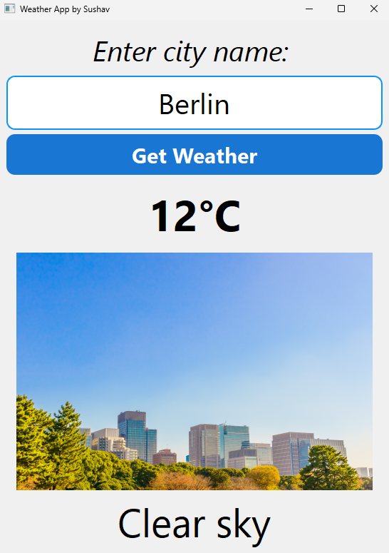

# WeatherApp 🌤️

A simple desktop weather application built with **Python** and **PyQt5**, showing real-time weather conditions for any city using the OpenWeatherMap API.



## Features

- 🔍 Search current weather by city name
- 🖼️ Dynamic weather icons matching current conditions
- ⚡ Simple, clean PyQt5 GUI

## Getting Started

### Prerequisites

- Python 3.11+
- A free API key from [OpenWeatherMap](https://openweathermap.org/api)

### Installation

1. Clone the repository
```bash
   git clone https://github.com/sushub69/WeatherApp.git
   cd WeatherApp
```

2. Install dependencies
```bash
   pip install -r requirements.txt
```

3. Add your OpenWeatherMap API key

   Open `tag32(WeatherApp).py` and replace the placeholder API key with your own:
```python
   API_KEY = "your_apikey_here"
```

4. Run the app
```bash
   python "tag32(WeatherApp).py"
```

## Built With

- [Python](https://www.python.org/) — core language
- [PyQt5](https://pypi.org/project/PyQt5/) — GUI framework
- [Requests](https://pypi.org/project/requests/) — HTTP requests to the weather API
- [OpenWeatherMap API](https://openweathermap.org/api) — weather data source


## Building an Executable

This app can be packaged into a standalone Windows `.exe` using PyInstaller:

```bash
pip install pyinstaller
python -m PyInstaller --onefile --windowed --name WeatherApp "tag32(WeatherApp).py"
```

The built executable will be in the `dist/` folder.

## Acknowledgments

- Built by following [BroCode's](https://www.youtube.com/@BroCodez) PyQt5 tutorial on YouTube with weather images used in place of the original emoji-based display
- Weather data provided by [OpenWeatherMap](https://openweathermap.org/)
